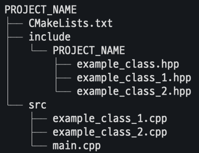

# CPP STL STUDY
C++ STL을 공부하기 위한 Repository입니다.

# 예제 빌드
```bash
cd ~/cpp-stl-study/
mkdir build && cd build
cmake ..
make
```

# 실행
```bash
cd ~/cpp-stl-study/build/bin
./project_name
```

# 예제 파일 구조


# CMakeList 예시
[CMakeList.txt](./examples/CMakeLists.txt)